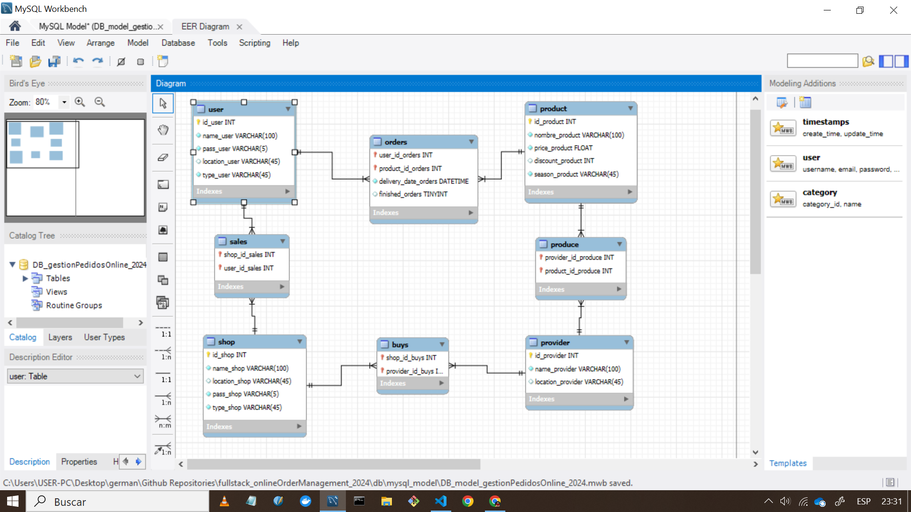

# Online Order Management System Backend

A backend system designed to help small businesses manage their online orders, inventory, and supplier relationships. Built with Node.js, Express, and MySQL.

## 🌟 Features

- Client management system
- Product catalog with seasonal categorization
- Shop/store management
- Producer/supplier relationship management
- Order tracking system
- Sales tracking
- Purchase order management

## 🛠️ Tech Stack

- **Runtime:** Node.js 20
- **Framework:** Express.js
- **Database:** MySQL
- **Container:** Docker & Docker Compose
- **Development:** Nodemon for hot-reloading

## 📊 Database Schema

The system includes the following main entities:
- Clients
- Products
- Shops
- Producers
- Orders
- Sales
- Purchases



## 🚀 Prerequisites

- Node.js 20 or higher
- Docker 
- npm or yarn package manager

### Environment Setup

1. Clone the repository:
```bash
git clone [your-repository-url]
cd [repository-name]
```

2. Create a `.env` file in the root directory with the following variables:
```env
MYSQL_HOST=database
MYSQL_ROOT_PASSWORD=your_root_password
MYSQL_DATABASE=DB_gestionPedidosOnline_2024
MYSQL_USER=your_username
MYSQL_PASSWORD=your_password
MYSQL_PORT=3306
```

### Installation & Running

1. Start the database container:
```bash
docker-compose up -d
```

2. Install dependencies:
```bash
npm install
```

3. Start the development server:
```bash
npm run dev
```

The server will be available at `http://localhost:3000`

## 🛡️ Security Features

- Password protection for clients and shops
- Secure database configuration
- Containerized deployment

## 🔄 Database Relationships

The system maintains several key relationships:
- Clients can place orders for products
- Shops can sell to clients
- Shops keep track of producers
- Producers can produce multiple products

## 🐳 Docker Configuration

The project includes:
- A Dockerfile for the Node.js application
- A docker-compose.yml file for orchestrating the MySQL database
- Volume mapping for database persistence

## 📝 Development

To contribute to the project:

1. Fork the repository
2. Create a feature branch
3. Make your changes
4. Submit a pull request

## 🔍 Future Enhancements

- API documentation
- Authentication middleware
- Order status tracking
- Real-time inventory updates

## 📄 License

[Your chosen license]

## 👥 Contributors

[Your name/team]

## 📞 Support

For support, please [create an issue](your-repository-issues-url) in the repository.
